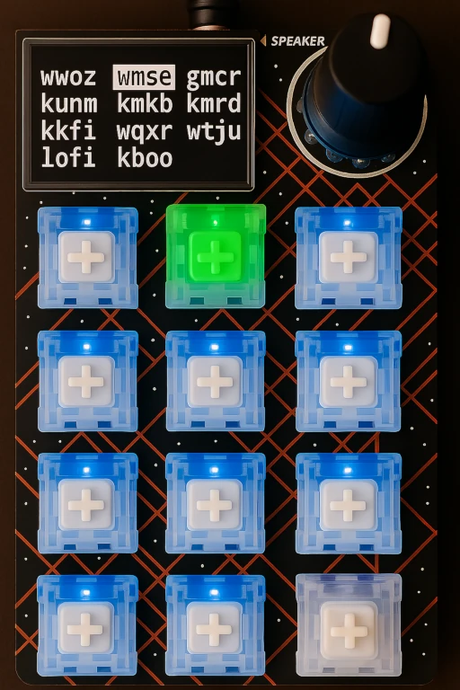

# radio-pad

Use the [Adafruit Macropad RP2040](https://learn.adafruit.com/adafruit-macropad-rp2040/overview) as a 🎵 radio station player 🎵.

**radio-pad** lets you use an Adafruit Macropad as a controller for playing internet radio stations on your computer (such as a Raspberry Pi). Each Macropad button can be mapped to a different station, and the host computer will play the selected station using [mpv](https://mpv.io/).



## Features

- Map each Macropad key to a different internet radio station
- Stop playback with a single press of the encoder (knob)
- Adjust volume by turning the encoder
- Easily customize stations and button colors

## How It Works

- The Macropad sends coded keypresses to a host.
- The host runs a listener script ([bin/radio-pad](bin/radio-pad)) that detects these keypresses and starts/stops playback of the corresponding radio stream(s).

## Macropad Controls

- **Key Buttons:**  
  Each key on the Macropad is mapped to a specific radio station. Pressing a key will start streaming the corresponding station.
- **Encoder Button (Knob Press):**  
  Pressing the encoder (the knob) will stop the currently playing radio station.
- **Encoder Position (Knob Turn):**  
  Turning the encoder knob adjusts the playback volume up or down.

## Quick Start

1. **Install dependencies:**

   ```sh
   sudo apt install mpv
   pip3 install prompt_toolkit python-mpv-jsonipc
   ```

2. **Clone the repository and run the listener:**

   ```sh
   git clone https://github.com/yourusername/radio-pad.git
   cd radio-pad
   ./bin/radio-pad
   ```

3. **Program your Macropad as described below.**

## Example Station Configuration

Edit [`src/config/stations.json`](./src/config/stations.json):

```json
[
  {"name": "WWOZ", "url": "https://www.wwoz.org/listen/hi"},
  {"name": "KEXP", "url": "https://kexp.org/stream"}
]
```

## Programming the Macropad

A linux host is assumed, with the macropad plugged into it. It must have python3 installed.

1. **Mount the Macropad storage:**

   ```sh
   bin/mount
   ```

2. **Customize stations and button colors:**
   - Edit [`src/macros/radio.py`](./src/macros/radio.py) for button assignments.
   - Edit [`src/config/stations.json`](./src/config/stations.json) to change the list of available stations.
3. **Sync your changes to the Macropad:**

   ```sh
   bin/refresh
   ```

## Usage

### Host Dependencies

- [mpv](https://mpv.io/)
- [prompt_toolkit](https://python-prompt-toolkit.readthedocs.io/en/master/)
- [python-mpv-jsonipc](https://github.com/iwalton3/python-mpv-jsonipc)

### Running the Listener

```sh
./bin/radio-pad
```

On a Raspberry Pi, you can start the listener at boot in a tmux session by adding the following to your auto-logged-in user's `.bashrc` file:

```sh
if tmux has-session -t radio-pad 2>/dev/null; then
  echo "radio-pad running. to attach:"
  echo "  tmux attach-session -t radio-pad"
else
  tmux new-session -s radio-pad radio-pad
fi
```

> tmux maintains the tty1 attachment whereas screen drops it if you attach via ssh.

## Troubleshooting Sound

If plugging in the Macropad interferes with your Alsa sound configuration (because it is also registered as a snd-usb-audio device), follow the "[How to choose a particular order for multiple installed cards](https://alsa.opensrc.org/MultipleCards#The_newer_.22slots.3D.22_method)" section of the Alsa docs.

For example, add the following to `/etc/modprobe.d/soundcard-order.conf`, where you get the vendor and product IDs from `lsusb` output:

```sh
# creative labs soundblaster: vid 0x041e pid 0x324d 
# adafruit macropad: vid 0x239a pid 0x8108
options snd-usb-audio index=0,1 vid=0x041e,0x239a pid=0x324d,0x8108
```

## Contributing

Pull requests and bug reports are welcome! Please [open an issue](https://github.com/yourusername/radio-pad/issues) or submit a PR.

## Support

For questions or help, please open an issue on the [GitHub repository](https://github.com/yourusername/radio-pad/issues).

## License

[BSD 3-Clause "New" or "Revised" License](./LICENSE)
