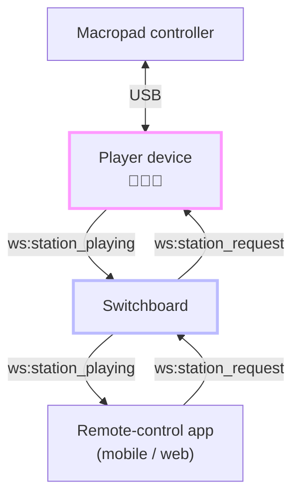
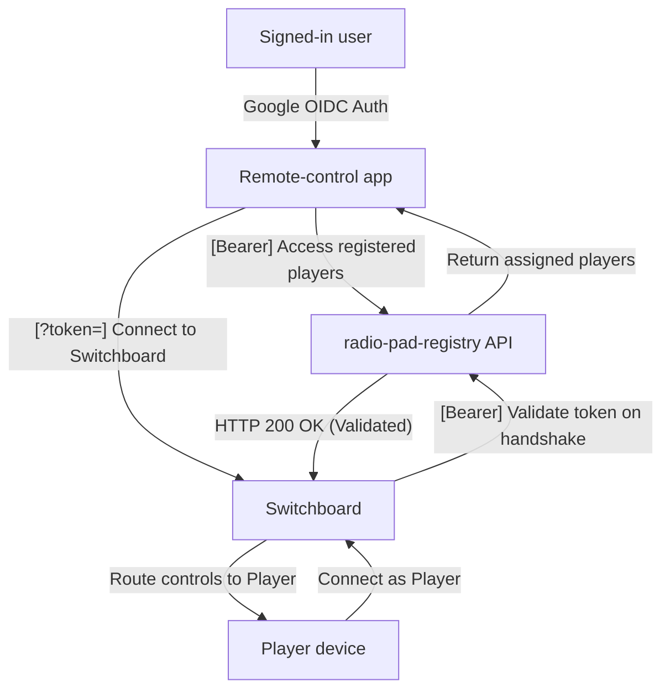

# radio-pad 

A 🎵 radio station player 🎵 with real-time syncing controllers.

The registry API and datastore implementation live in [`radio-pad-registry`](https://github.com/briceburg/radio-pad-registry).

## Overview

* The radio-pad [player](./player/) runs on a host (such as a Raspberry Pi) connected to a stereo/speakers.
* Controllers, such as a USB-connected [macropad](./macropad-control/), request the station to play.
* [Stations](./player/stations.json) are configurable.

### Local control

**radio-pad** lets you use a USB-connected [macropad](./macropad-control/) as a controller for playing internet radio stations on your computer (such as a Raspberry Pi).

* Each Macropad button is mapped to a different station.
* The encoder knob adjusts volume if a station is playing, or switches station pages if there are more than 12 stations.
* Pressing the encoder knob will stop playing.

### Remote control

**radio-pad** is optionally controlled through a [switchboard](./switchboard/) of connected [clients](./remote-control/), such as mobile apps or web browsers.

* Clients and the radio-pad player connect to the switchboard to request and broadcast station changes.
* The switchboard can run on the local network or as an internet-available service.
* WebSockets are used for real-time syncing of clients, such as updating the currently playing station.

## Getting started

There are four components that make up radio-pad. Each is broken out into a folder which _may_ become a git repository. Visit these folders for details on installation and usage:

* The [player](./player/) runs on a host and defines [stations](./player/README.md#editing-stations).
* The [macropad-control](./macropad-control/) connects to the host over USB.
* The [switchboard](./switchboard/) is _optional_ and needed to support remote-control.
* The [remote-control](./remote-control/) is used to create mobile and web clients for controlling the player.

  

## Architecture

### Core control flow

```mermaid
flowchart TD
    Macropad["Macropad controller"]
    Player["Player device<br/>🎵🎵🎵"]
    Switchboard["Switchboard"]
    Remote["Remote-control app<br/>(mobile / web)"]

    Macropad <-- USB --> Player
    Player -- ws:station_playing --> Switchboard
    Switchboard -- ws:station_request --> Player
    Switchboard -- ws:station_playing --> Remote
    Remote -- ws:station_request --> Switchboard

    style Player stroke:#f9f,stroke-width:3px
    style Switchboard stroke:#bbf,stroke-width:3px
```

This is the baseline runtime view: controllers talk to players directly over USB or indirectly through the switchboard.

### Registry and player access

```mermaid
flowchart TD
    User["Signed-in user"]
    Remote["Remote-control app"]
    Registry["radio-pad-registry API"]
    Switchboard["Switchboard"]
    Player["Player device"]

    User -- "Google OIDC Auth" --> Remote
    Remote -- "[Bearer] Access registered players" --> Registry
    Registry -- "Return assigned players" --> Remote
    Remote -- "[?token=] Connect to Switchboard" --> Switchboard
    Switchboard -- "[Bearer] Validate token on handshake" --> Registry
    Registry -- "HTTP 200 OK (Validated)" --> Switchboard
    Player -- "Connect as Player" --> Switchboard
    Switchboard -- "Route controls to Player" --> Player
```

Player control stays strictly authenticated end-to-end:

* The remote-control signs in to get an OIDC Bearer token.
* Controllers request access to their registered resources using this token.
* During WebSocket connection, controllers supply their OIDC validation token.
* The switchboard makes a synchronous HTTP validation check back to the registry before upgrading the socket.
* Unauthorized connections are outright rejected.

### Contributing

Pull requests and bug reports are welcome! Please [open an issue](https://github.com/briceburg/radio-pad/issues) or submit a PR.

## Support

For questions or help, please open an issue on the [GitHub repository](https://github.com/briceburg/radio-pad/issues).

### TODO

* Use MIDI control sequences or usb-cdc instead of keypresses for radio control. This is necessary to support bi-directional communication, e.g. to notify macropad of station changes from remote controls.
* Pass the list of stations to macropad (via USB connection) and controllers (via switchboard). We can thus handle live station updates, as well as defer startup until communication with the player has been established.
