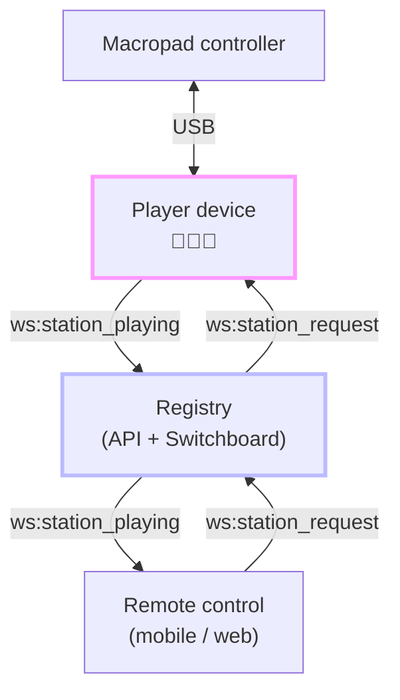
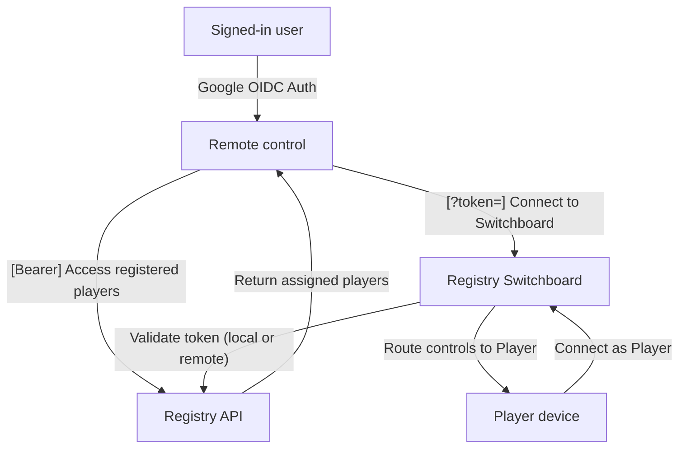

# radio-pad 

A 🎵 radio station player 🎵 with real-time syncing controllers.


## Overview

* The radio-pad [player](./player/) runs on a host (such as a Raspberry Pi) connected to a stereo/speakers.
* Controllers — a USB-connected [macropad](./macropad-control/) or a [remote control](./remote-control/) app (web/mobile) — request the station to play.
* Stations are managed as [station presets](./registry/seed-data/store/presets/) in the registry.

### Local control

**radio-pad** lets you use a USB-connected [macropad](./macropad-control/) as a controller for playing internet radio stations on your computer (such as a Raspberry Pi).

* Each Macropad button is mapped to a different station.
* The encoder knob adjusts volume if a station is playing, or switches station pages if there are more than 12 stations.
* Pressing the encoder knob will stop playing.


### Remote control

**radio-pad** is optionally controlled through the [registry's](./registry/) built-in switchboard and connected [remote controls](./remote-control/), such as mobile apps or web browsers.

* Remote controls and the player connect to the switchboard via WebSockets to request and broadcast station changes in real time.
* The registry is a [dual-mode service](#deployment-modes) (API + switchboard) that can also be split for independent scaling.

## Components

| Component | Description |
|-----------|-------------|
| [player](./player/) | Runs on a host and plays stations from a [station preset](./player/README.md#registry-discovery). |
| [macropad-control](./macropad-control/) | USB-connected macropad controller. |
| [registry](./registry/) | API + switchboard service. Manages accounts, players, station presets, and WebSocket routing. |
| [remote-control](./remote-control/) | Web and mobile remote control for the player. |

<p align="center" width="100%">
  
</p>

## Development

Docker Compose provides the local development environment. All services mount source for live reloading.

```sh
# Start all services (unified: registry serves API + switchboard)
docker compose up

# Or split mode (registry and switchboard as separate services)
docker compose -f compose.split.yaml up
```

Ports default to ephemeral (see [.env](.env)). Override in `.env` to pin them:

```
RADIOPAD_REGISTRY_PORT=1980
RADIOPAD_REMOTE_CONTROL_PORT=5173
```

View assigned ports:

```sh
docker compose ps --format 'table {{.Service}}\t{{.Ports}}'
```

See each component README for standalone usage and additional configuration:
[player](./player/README.md) · [registry](./registry/README.md) · [remote-control](./remote-control/README.md) · [macropad-control](./macropad-control/README.md)

### Running integration tests

Integration tests validate cross-service behavior (reachability, handshakes, message routing, seeded data).
Individual project tests live within each component folder.

```sh
# Unified mode
bin/ci

# Split mode
COMPOSE_FILE=compose.split.yaml bin/ci
```

### Local macropad testing

If you change the macropad firmware in [`macropad-control`](./macropad-control/), sync it to the device first:

```sh
cd macropad-control
bin/refresh
```

The default compose files do not expose host USB serial devices to the `player` container. For manual end-to-end testing with a real macropad attached, layer in the local override and point it at the device path:

Determine the port first:

```sh
/home/nesta/git/radio-pad/player/venv/bin/python -m serial.tools.list_ports -v

# or from macropad-control:
macropad-control/bin/status

# or, on a typical Linux host:
ls -l /dev/ttyACM* /dev/ttyUSB*
```

If those commands show no ports, the macropad is not visible to this Linux environment yet. In WSL2 that usually means the USB device has not been attached/passed through, so unplugging and replugging alone is usually not enough.

```sh
RADIOPAD_MACROPAD_PORT=/dev/ttyACM1 \
docker compose -f compose.yaml -f compose.macropad.yaml up
```

## Architecture

### Deployment modes

The registry is controlled by the `REGISTRY_PROFILES` environment variable:

| Mode | `REGISTRY_PROFILES` | Description |
|------|---------------------|-------------|
| **Unified** | `api,switchboard` (default) | Single process serves the REST API and WebSocket switchboard. Simplest to deploy and operate. |
| **Split** | `api` / `switchboard` separately | API and switchboard run as independent services. The switchboard validates tokens via HTTP call back to the API. Allows independent scaling of stateless API replicas vs. long-lived WebSocket connections. |

`compose.yaml` runs unified mode. `compose.split.yaml` demonstrates the split topology and is also tested in CI.

### Core control flow


```mermaid
flowchart TD
    Macropad["Macropad controller"]
    Player["Player device<br/>🎵🎵🎵"]
    Registry["Registry<br/>(API + Switchboard)"]
    Remote["Remote control<br/>(mobile / web)"]

    Macropad <-- USB --> Player
    Player -- ws:station_playing --> Registry
    Registry -- ws:station_request --> Player
    Registry -- ws:station_playing --> Remote
    Remote -- ws:station_request --> Registry

    style Player stroke:#f9f,stroke-width:3px
    style Registry stroke:#bbf,stroke-width:3px
```

This is the baseline runtime view: controllers talk to players directly over USB or indirectly through the registry's switchboard.

### Registry and player access


```mermaid
flowchart TD
    User["Signed-in user"]
    Remote["Remote control"]
    Registry["Registry API"]
    Switchboard["Registry Switchboard"]
    Player["Player device"]

    User -- "Google OIDC Auth" --> Remote
    Remote -- "[Bearer] Access registered players" --> Registry
    Registry -- "Return assigned players" --> Remote
    Remote -- "[?token=] Connect to Switchboard" --> Switchboard
    Switchboard -- "Validate token (local or remote)" --> Registry
    Player -- "Connect as Player" --> Switchboard
    Switchboard -- "Route controls to Player" --> Player
```

Player control is authenticated end-to-end:

* The remote control signs in to get an OIDC Bearer token.
* It requests access to registered players using this token.
* During WebSocket connection, the remote control supplies the token as a query parameter.
* The switchboard validates the token locally (unified mode) or via HTTP call to the registry API (split mode).
* Unauthorized connections are rejected.

### Contributing

Pull requests and bug reports are welcome! Please [open an issue](https://github.com/briceburg/radio-pad/issues) or submit a PR.

## Support

For questions or help, please open an issue on the [GitHub repository](https://github.com/briceburg/radio-pad/issues).
