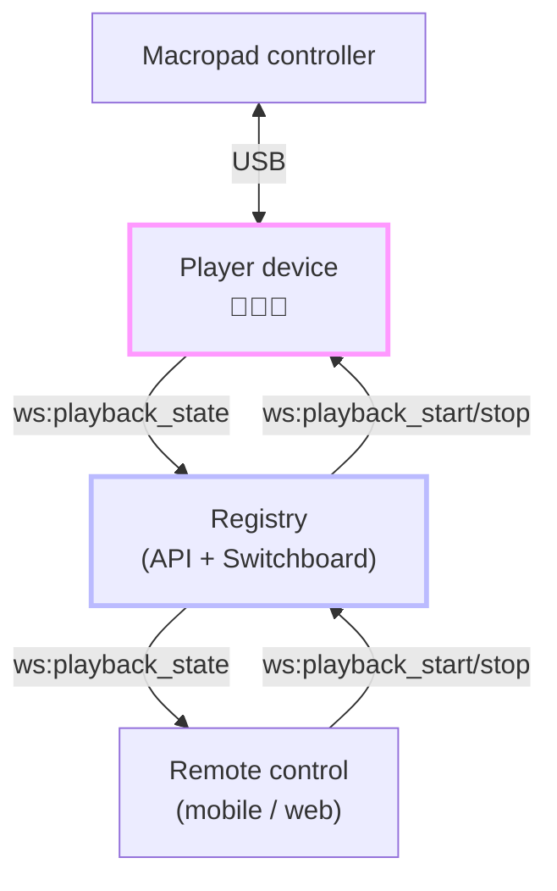
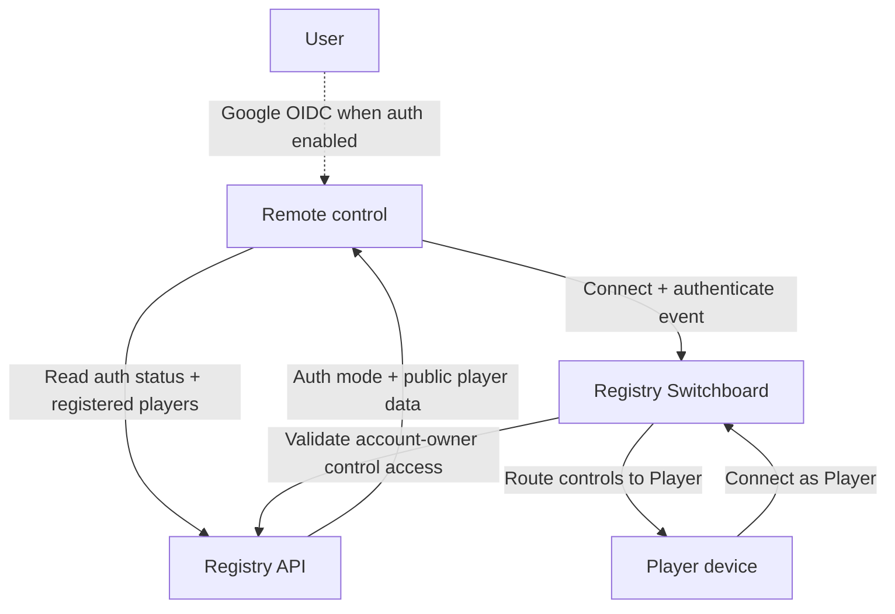

# radio-pad

A 🎵 radio station player 🎵 with real-time syncing controllers.


## Overview

* The [player](./player/) streams internet radio through a host's audio output and owns playback and volume.
* Controllers — a USB [macropad](./macropad-control/) or the web/mobile [remote control](./remote-control/) — tell a player what to play.
* The [registry](./registry/) assigns players curated, shareable [RadioDials](./registry/seed-data/store/accounts/community/radio-dials/) of account-owned Stations.

### Local control

**radio-pad** lets you use a USB-connected [macropad](./macropad-control/) as a controller for playing internet radio stations on your computer (such as a Raspberry Pi).

* Each Macropad button is mapped to a different station.
* The encoder knob adjusts volume if a station is playing, or switches station pages if there are more than 12 stations.
* Pressing the encoder knob will stop playing.


### Remote control

**radio-pad** is optionally controlled through the [registry's](./registry/) built-in switchboard and connected [remote controls](./remote-control/), such as mobile apps or web browsers.

* Remote controls and the player connect to the switchboard via WebSockets to request and broadcast station changes in real time.
* The registry is a [dual-mode service](#deployment-modes) (API + switchboard) that can also be split for independent scaling.

## Components

| Component | Description |
|-----------|-------------|
| [player](./player/) | Audio runtime that loads its assigned RadioDial, streams the selected Station, and reports playback status. |
| [macropad-control](./macropad-control/) | Physical USB controller for Station selection, stop, and volume. |
| [registry](./registry/) | Stores accounts, Stations, RadioDials, and player assignments; serves the API and switchboard. |
| [remote-control](./remote-control/) | Web/mobile controller for discovering players and RadioDials, selecting Stations, and viewing status. |

<p align="center" width="100%">
  
</p>

## Development

### Toolchain and dependency policy

Tool versions live at the smallest project boundary that consumes them. Python components (`player`, `registry`, `macropad-control`, and `tests/integration`) own their `pyproject.toml` and `uv.lock`; those files declare `requires-python`, runtime and development dependencies, and project-local cache settings. The remote-control app owns `package.json` and `package-lock.json`; Docker and CI read those files from `remote-control/`.

CI and Docker pins are part of the policy surface. Python images copy `uv` from `ghcr.io/astral-sh/uv` and install from component-local `pyproject.toml` and `uv.lock`; the GitHub Actions Python job pins the same `uv` version for each Python project. The web image and CI job use Node 22, while `remote-control/package.json` declares the app's minimum Node engine.

Dependency updates should be scoped to the component being changed. Edit that component's manifest, regenerate only its lockfile, and run its `bin/ci` or the cheapest relevant check; update matching Dockerfile or GitHub Actions pins only when the runtime or package-manager version itself changes. Do not refresh unrelated locks as part of feature work.

There is intentionally no root `uv` or `npm` workspace. The components build and deploy from separate Docker contexts, and the repo root orchestrates Compose and CI rather than owning a shared package graph; keeping locks independent avoids accidental cross-component upgrades and keeps production image inputs explicit.

Docker Compose provides the local development environment. All services mount source for live reloading.

```sh
# Start all services (unified: registry serves API + switchboard)
bin/dev up

# Or split mode (registry and switchboard as separate services)
docker compose -f compose.split.yaml up
```

`bin/dev` wraps `docker compose` and passes through compose arguments. By default it exposes local ALSA devices when `/dev/snd` exists and uses the physical macropad overlay when exactly one CDC2 data port is attached. It adds the player to the required host device groups instead of running it as root. If no macropad is found it starts without one; multiple ports require `RADIOPAD_MACROPAD_DEVICE`:

```sh
bin/dev up -d
RADIOPAD_MACROPAD=required bin/dev up -d --force-recreate player
RADIOPAD_MACROPAD=off bin/dev up
```

Set `RADIOPAD_MACROPAD_DEVICE=/dev/ttyACM...` to choose a specific macropad data port. `bin/dev` does not mount or sync firmware; those steps stay explicit because they can prompt for privileges and write to the device.

Use `compose.audio.yaml` or `compose.macropad.yaml` directly only when you need explicit compose overlays outside `bin/dev`; in that case set `RADIOPAD_AUDIO_GID`, `RADIOPAD_MACROPAD_GID`, and `RADIOPAD_MACROPAD_DEVICE` yourself.

Registry and switchboard ports default to ephemeral; the web app defaults to port 5173 for stable OAuth redirect URIs. Copy `.env.example` to `.env` to configure overrides or to enable Google sign-in, registry write auth, and authenticated player control. See [remote-control](./remote-control/README.md#web-development) for OAuth client setup and [registry](./registry/README.md#authentication-and-account-owner-seeding) for authz seeding.

```sh
cp .env.example .env
```

View assigned ports:

```sh
docker compose ps --format 'table {{.Service}}\t{{.Ports}}'
```

See each component README for standalone usage and additional configuration:
[player](./player/README.md) · [registry](./registry/README.md) · [remote-control](./remote-control/README.md) · [macropad-control](./macropad-control/README.md)

### Running checks

Integration tests validate cross-service behavior (reachability, handshakes, message routing, seeded data).
Individual project tests live within each component folder.

Use `bin/check` to run all component check suites from the repo root. It runs the Python component checks, remote-control checks, and integration test static checks/collection without starting the Compose stack.

Root `bin/ci` keeps compose integration runs isolated from local `.env` development settings by defaulting registry, switchboard, and remote-control host ports to ephemeral values, forcing headless audio output, and clearing `GOOGLE_CLIENT_ID` so auth stays disabled unless a test explicitly enables it.

```sh
# Component checks
bin/check

# Unified mode
bin/ci

# Split mode
bin/ci compose.split.yaml

# Production images and healthchecks
bin/ci compose.prod-smoke.yaml
```

### Testing with a macropad

Mount the macropad once after attaching it, sync local firmware changes, verify the device state, then discover the post-sync CDC2 data port and recreate the player:

```sh
macropad-control/bin/mount
macropad-control/bin/sync
macropad-control/bin/doctor

RADIOPAD_MACROPAD=required bin/dev up -d --force-recreate player
```

The discovery command intentionally fails when it finds zero or multiple data ports. Set `RADIOPAD_MACROPAD_DEVICE=/dev/ttyACM...` directly when more than one macropad is attached. Sync before creating the player container because CircuitPython may reboot and renumber its USB interfaces during a firmware update. Use `macropad-control/bin/console` for the CircuitPython REPL console; it intentionally selects a different USB CDC interface than `macropad-control/bin/data-port`.

## Architecture

### Deployment modes

The registry is controlled by the `REGISTRY_PROFILES` environment variable:

| Mode | `REGISTRY_PROFILES` | Description |
|------|---------------------|-------------|
| **Unified** | `api,switchboard` (default) | Single process serves the REST API and WebSocket switchboard. Simplest to deploy and operate. |
| **Split** | `api` / `switchboard` separately | API and switchboard run as independent services. The switchboard validates controller access via an HTTP call back to the API. Allows independent scaling of stateless API replicas vs. long-lived WebSocket connections. |

`compose.yaml` runs unified mode. `compose.split.yaml` demonstrates the split topology and is also tested in CI.

### Core control flow


```mermaid
flowchart TD
    Macropad["Macropad controller"]
    Player["Player device<br/>🎵🎵🎵"]
    Registry["Registry<br/>(API + Switchboard)"]
    Remote["Remote control<br/>(mobile / web)"]

    Macropad <-- USB --> Player
    Player -- ws:playback_state --> Registry
    Registry -- ws:playback_start/stop --> Player
    Registry -- ws:playback_state --> Remote
    Remote -- ws:playback_start/stop --> Registry

    style Player stroke:#f9f,stroke-width:3px
    style Registry stroke:#bbf,stroke-width:3px
```

This is the baseline runtime view: controllers talk to players directly over USB or indirectly through the registry's switchboard.

### Registry and player access


```mermaid
flowchart TD
    User["User"]
    Remote["Remote control"]
    Registry["Registry API"]
    Switchboard["Registry Switchboard"]
    Player["Player device"]

    Remote -- "Read auth status + registered players" --> Registry
    Registry -- "Auth mode + public player data" --> Remote
    User -. "Google OIDC when auth enabled" .-> Remote
    Remote -- "Connect + authenticate event" --> Switchboard
    Switchboard -- "Validate account-owner control access" --> Registry
    Player -- "Connect as Player" --> Switchboard
    Switchboard -- "Route controls to Player" --> Player
```

Player control follows the registry's advertised auth mode:

* Player registry reads remain public.
* Every controller connection starts with an `authenticate` event; its token is null when registry auth is disabled.
* When registry auth is enabled, the remote signs in and supplies its OIDC token only in that first WebSocket message, never in the URL.
* The switchboard validates account-owner control access locally (unified mode) or through the registry API (split mode).
* The switchboard sends `authenticated` before replaying state or accepting commands. Unauthorized or expired sessions close with policy code `1008`.

### Contributing

Pull requests and bug reports are welcome! Please [open an issue](https://github.com/briceburg/radio-pad/issues) or submit a PR.

## Support

For questions or help, please open an issue on the [GitHub repository](https://github.com/briceburg/radio-pad/issues).
