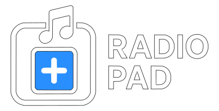
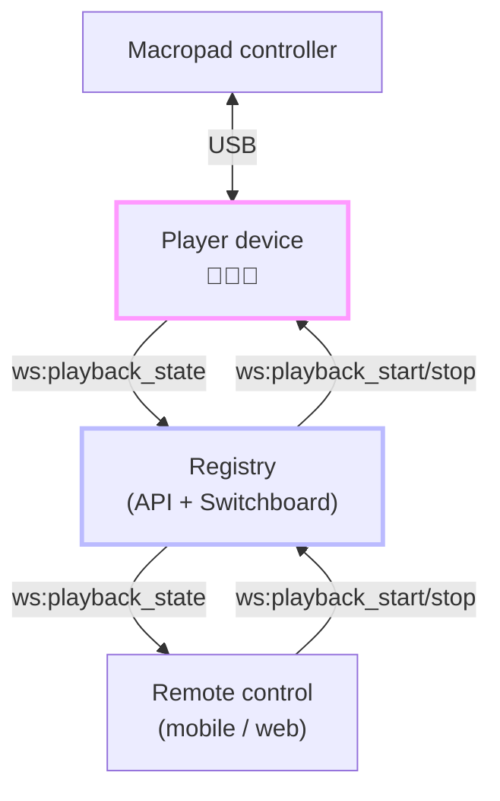
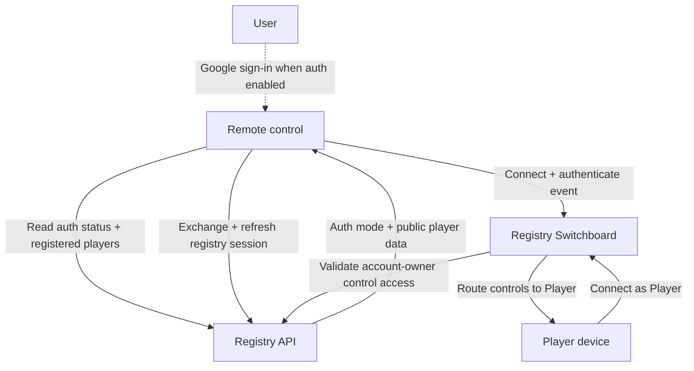

# RadioPad

An internet radio player with physical, web, and mobile controllers that stay in sync.



## How it works

- The [player](./player/) streams internet radio through a host's audio output and owns playback and volume.
- A USB [Macropad](./macropad-control/) or the web/mobile [remote control](./remote-control/) tells the player what to play.
- The [registry](./registry/) assigns players curated, shareable [RadioDials](./registry/seed-data/data/accounts/community/radio-dials/) of account-owned Stations and relays remote commands over WebSockets.


## Components

| Component | Description |
| --- | --- |
| [player](./player/) | Audio runtime that loads its assigned RadioDial, streams the selected Station, and reports playback status. |
| [macropad-control](./macropad-control/) | Physical USB controller for Station selection, stop, and volume. |
| [registry](./registry/) | Stores accounts, Stations, RadioDials, and player assignments; serves the API and switchboard. |
| [remote-control](./remote-control/) | Web/mobile controller for discovering players and RadioDials, selecting Stations, and viewing status. |

This README covers the integrated repository. Each component README owns its standalone requirements, configuration, development workflow, and deployment guidance.

## Development

Docker Compose is the supported way to run the complete system locally. The stack requires Compose v2; `bin/dev` host audio and USB integration targets Bash on Linux.

### Quick start

Copy the optional local configuration, then start the unified stack:

```sh
cp .env.example .env
bin/dev up --build
```

Open `http://localhost:5173`. The remote control proxies registry and switchboard traffic within Compose, so their host ports do not need to be pinned.

For a headless stack with no host audio or Macropad:

```sh
RADIOPAD_AUDIO=off RADIOPAD_AUDIO_OUTPUT=null RADIOPAD_MACROPAD=off bin/dev up --build
```

### Compose modes

| File | Purpose |
| --- | --- |
| `compose.yaml` | Default development stack; one registry process serves both the API and switchboard. |
| `compose.split.yaml` | Development stack with separate API and switchboard services for scaling and load tests. |
| `compose.auth.yaml` | Registry auth overlay for `compose.yaml`, with local OIDC and revocation fixtures. |
| `compose.prod-smoke.yaml` | Production-image build and healthcheck integration test. |

`bin/dev` loads `compose.yaml` plus detected host overlays. Add the split configuration when working across the API/switchboard boundary:

```sh
bin/dev -f compose.split.yaml up --build
```

Registry and switchboard host ports default to ephemeral values; inspect them with:

```sh
docker compose ps --format 'table {{.Service}}\t{{.Ports}}'
```

### Configuration and host integration

Docker Compose reads `.env` from the repository root. The checked-in [.env.example](./.env.example) documents port, authentication, and player-output values. The remote-control port defaults to `5173` for a stable browser and OAuth origin.

`bin/dev` routes player audio through an available Pulse-compatible or native PipeWire socket and adds the Macropad overlay when exactly one CircuitPython CDC2 data port is found. Require a programmed Macropad when recreating the player with:

```sh
RADIOPAD_MACROPAD=required bin/dev up -d --force-recreate player
```

Follow the [Macropad programming guide](./macropad-control/README.md#programming-the-macropad) for device setup. `bin/dev` never writes firmware; `bin/dev --help` lists audio, socket, and device overrides.

Set `bin/dev` audio and Macropad options in the shell; `.env` is read by Compose only.

### Google sign-in

Authentication is disabled when `GOOGLE_CLIENT_ID` is unset. To exercise authenticated control, create a Google **Web application** OAuth client with:

- JavaScript origin `http://localhost:5173`
- Redirect URI `http://localhost:5173/`

Set the public client ID in the root `.env`:

```dotenv
GOOGLE_CLIENT_ID=your-client-id.apps.googleusercontent.com
```

The client ID becomes the registry token audience and is embedded in the Compose remote-control build; the downloaded OAuth JSON and client secret are not used. Recreate `registry` and `remote-control` after changing it. See the [remote-control README](./remote-control/README.md#local-configuration) for standalone and native setup, and the [registry README](./registry/README.md#authentication-and-authz) for server authz.

### Validation

Host checks require Node.js 22 with npm and [uv](https://docs.astral.sh/uv/):

```sh
npm ci
(cd remote-control && npm ci)
bin/ci                                   # formatting and component checks
bin/ci integration                       # all Compose integration tests
bin/ci integration compose.split.yaml    # only the split-mode integration test
```

Pass multiple Compose files to run any other combination.

### Toolchain and dependency policy

Each project owns its manifest, lockfile, and `bin/ci`; the root npm package owns only repository-wide tooling. Keep dependency changes within that boundary and do not introduce workspaces or consolidate lockfiles unless intentionally changing the repository structure. Run `npm run format` from the root for repository-wide formatting.

## Architecture

### Core control flow


```mermaid
flowchart TD
    Macropad["Macropad controller"]
    Player["Player device<br/>🎵🎵🎵"]
    Registry["Registry<br/>(API + Switchboard)"]
    Remote["Remote control<br/>(mobile / web)"]

    Macropad <-- USB --> Player
    Player -- ws:playback_state --> Registry
    Registry -- ws:playback_start/stop --> Player
    Registry -- ws:playback_state --> Remote
    Remote -- ws:playback_start/stop --> Registry

    style Player stroke:#f9f,stroke-width:3px
    style Registry stroke:#bbf,stroke-width:3px
```

Controllers talk to players directly over USB or indirectly through the registry's switchboard. In the split Compose configuration, the API and switchboard run separately but retain the same external behavior.

### Registry and player access


```mermaid
flowchart TD
    User["User"]
    Remote["Remote control"]
    Registry["Registry API"]
    Switchboard["Registry Switchboard"]
    Player["Player device"]

    Remote -- "Read auth status + registered players" --> Registry
    Registry -- "Auth mode + public player data" --> Remote
    User -. "Google sign-in when auth enabled" .-> Remote
    Remote -- "Exchange + refresh registry session" --> Registry
    Remote -- "Connect + authenticate event" --> Switchboard
    Switchboard -- "Validate account-owner control access" --> Registry
    Player -- "Connect as Player" --> Switchboard
    Switchboard -- "Route controls to Player" --> Player
```

Player control follows the registry's advertised auth mode:

- Player registry reads remain public.
- Every controller connection starts with an `authenticate` event; its token is null when registry authentication is disabled.
- When authentication is enabled, the remote exchanges Google sign-in once and supplies a short-lived registry token only in the first WebSocket message, never in the URL.
- The switchboard validates account-owner control access locally in unified mode or through the registry API in split mode.
- The switchboard sends `authenticated` before replaying state or accepting commands. Unauthorized or expired sessions close with policy code `1008`.

## Contributing and support

Pull requests and bug reports are welcome. For questions, help, or feature requests, [open an issue](https://github.com/briceburg/radio-pad/issues).
