# radio-pad 

A 🎵 radio station player 🎵 with real-time syncing controllers.

## overview

* the radio-pad [player](./player/) runs on a host, such as a raspberry pi, connected to a stereo/speakers.
* controllers, such as a USB-connected [macropad](./macropad-controller/), request the station to play.
* [stations](./player/stations.json) are configurable.

### local control

**radio-pad** lets you use a USB-connected [macropad](./macropad-controller/) as a controller for playing internet radio stations on your computer (such as a Raspberry Pi).

* each Macropad button is mapped to a different station.
* the encoder knob adjusts volume if a station is playing, or switches station pages if there are more than 12 stations.
* pressing the encoder knob will stop playing.

### remote control

**radio-pad** is optionally controlled through a [switchboard](./switchboard/) of connected [clients](./remote-controller/), such as mobile apps or web browsers.

* clients and the radio-pad player connect to the switchboard to request and broadcast station changes.
* the switchboard can run on the local network, or as an internet available service.
* websockets are used for real-time syncing of clients, such as updating the currently playing station.

## getting started

there are four components that makeup radio-pad. each is broken out into a folder which _may_ become a git repository. visit this folder for details/installation/use.

* the [player](./player/), this runs on a host and defines [stations](./player/README.md#editing-stations).
* the [macropad-controller](./macropad-controller/), this connects to the host over USB.
* the [switchboard](./switchboard/), this is _optional_ and needed to support remote-control.
* the [remote-control](./remote-controller/), used to create mobile and web clients for controlling the player.

## Development

### Reference

```mermaid
flowchart TD
    %% Nodes
    Macropad["Macropad Controller"]
    Player["Player<br/>🎵🎵🎵"]
    Switchboard["Switchboard<br/>(Syncs Player and Controls)"]
    RemoteMobile["Remote Controller<br/>(Mobile App)"]
    RemoteWeb["Remote Controller<br/>(Web App)"]

    %% Connections
    Macropad <-- USB --> Player
    Player -- ws:station_playing --> Switchboard
    Switchboard -- ws:station_request --> Player
    Switchboard -- ws:station_playing --> RemoteMobile
    Switchboard -- ws:station_playing --> RemoteWeb
    RemoteMobile -- ws:station_request --> Switchboard
    RemoteWeb -- ws:station_request --> Switchboard

    %% Highlight Player and Switchboard
    style Player stroke:#f9f,stroke-width:3px
    style Switchboard stroke:#bbf,stroke-width:3px
```

### Contributing

Pull requests and bug reports are welcome! Please [open an issue](https://github.com/briceburg/radio-pad/issues) or submit a PR.

## Support

For questions or help, please open an issue on the [GitHub repository](https://github.com/briceburg/radio-pad/issues).

### TODO

* use MIDI control sequences or usb-cdc instead of keypresses for radio control. this is necessary to support bi-directial communication, e.g. to notify macropad of station changes from remote controls.
* pass the list of stations to macropad (via usb connection) and controllers (via switchboard). we can thus handle live station updates, as well as defer startup until communication with the player has been established.

