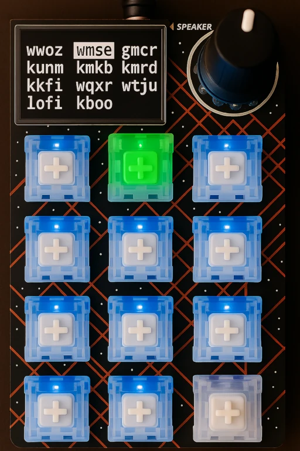

# radio-pad macropad-control

Use the [Adafruit Macropad RP2040](https://learn.adafruit.com/adafruit-macropad-rp2040/overview) as a 🎵 radio station controller 🎵.

**radio-pad** lets you use an Adafruit Macropad as a controller for playing internet radio stations on your computer (such as a Raspberry Pi). Each Macropad button can be mapped to a different station, and the host computer will play the selected station using [mpv](https://mpv.io/).



## How It Works

- The Macropad sends coded keypresses to a host.
- The host runs a [listener script](../player/) that detects these keypresses and starts/stops playback of the corresponding radio stream(s).

## Macropad Controls

- **Key Buttons:**  
  Each key on the Macropad is mapped to a specific radio station. Pressing a key will start streaming the corresponding station.
- **Encoder Button (Knob Press):**  
  Pressing the encoder (the knob) will stop the currently playing radio station.
- **Encoder Position (Knob Turn):**  
  Turning the encoder knob adjusts the playback volume up or down. If playback is stopped, and there are more than 12 stations, turning the encoder knob will switch station pages.
- **Title Bar Status:**  
  The title bar normally shows the current page or playing station, but it temporarily switches to player health details such as station loading, switchboard outages, and playback failures.
- **Waiting / Loading Keys:**  
  When the macropad is waiting for the player, the key LEDs show a soft grey breathing placeholder animation. Once the player is connected and stations are loading, the placeholder animation shifts to amber.
- **Upstream Warning Keys:**  
  When the player is connected but the switchboard is down, the title warns about the outage and idle station keys shift to a muted amber warning color while the active station stays highlighted.

## Usage

First, program the macropad, then connect it to a host running the [player](../player/).

### Programming the Macropad

A linux host is assumed, with the macropad plugged into it. It must have python3 installed.

1. **Mount the Macropad storage:**

   ```sh
   bin/mount
   ```

   If you just want to inspect what the repo can currently see, run:

   ```sh
   bin/status
   ```

2. **Customize button colors and behavior:**
   - Edit [`src/main.py`](./src/main.py) to change macropad key behavior.
   - Stations are received from the connected [player](../player/), which loads them from a registry [station preset](../player/README.md#registry-discovery).
3. **Sync your changes to the Macropad:**

   ```sh
   bin/refresh
   ```

   `bin/refresh` will automatically run `bin/mount` if the CIRCUITPY volume is not mounted yet.

4. **Debug via the USB serial console**

Attaching to the console allows you to read stdout/stderr, for instance to view exceptions or debug messages.
  
  ```sh
  bin/console
  ```

  The player uses the CircuitPython `CDC2` port for commands and events, while `bin/console` targets the primary CircuitPython console port.

  > serial access requires that the executing user has access to `/dev/ttyACM*` devices, which are owned by the `uucp` group in archlinux.

### WSL Notes

In WSL2, the macropad needs to be attached into Linux with USB/IP before the storage and `/dev/ttyACM*` devices appear. Once attached, this project expects:

- player data port: `/dev/ttyACM1` (`CircuitPython CDC2`)
- console port: `/dev/ttyACM0` (`CircuitPython CDC`)

## Development

### Troubleshooting Sound

If plugging in the Macropad interferes with your Alsa sound configuration (because it is also registered as a snd-usb-audio device), follow the "[How to choose a particular order for multiple installed cards](https://alsa.opensrc.org/MultipleCards#The_newer_.22slots.3D.22_method)" section of the Alsa docs.

For example, add the following to `/etc/modprobe.d/soundcard-order.conf`, where you get the vendor and product IDs from `lsusb` output:

```sh
# creative labs soundblaster: vid 0x041e pid 0x324d 
# adafruit macropad: vid 0x239a pid 0x8108
options snd-usb-audio index=0,1 vid=0x041e,0x239a pid=0x324d,0x8108
```


### Contributing

Pull requests and bug reports are welcome! Please [open an issue](https://github.com/briceburg/radio-pad/issues) or submit a PR.

## Support

For questions or help, please open an issue on the [GitHub repository](https://github.com/briceburg/radio-pad/issues).

## License

[GNU General Public License v3.0](./LICENSE)
