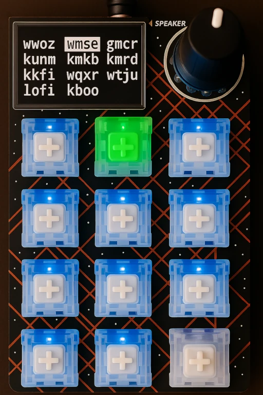

# radio-pad macropad-control

Use the [Adafruit Macropad RP2040](https://learn.adafruit.com/adafruit-macropad-rp2040/overview) as a 🎵 radio station controller 🎵.

**radio-pad** lets you use an Adafruit Macropad as a controller for playing internet radio stations on your computer (such as a Raspberry Pi). Each Macropad button can be mapped to a different station, and the host computer will play the selected station using [mpv](https://mpv.io/).



## How It Works

- The Macropad communicates with the host [player](../player/) over USB serial (CircuitPython CDC2).
- The player sends a compact station menu, heartbeat, playback state, and status events; the Macropad renders them on the OLED and NeoPixel keys.
- Pressing a key sends a playback start command to the player.

### Visual States

| State | OLED title row | NeoPixel keys |
|-------|----------------|---------------|
| Waiting for player | `Waiting for Player` | Dim grey skeleton animation |
| Loading RadioDial | `Loading RadioDial` or a short status | Grey station-slot skeleton animation |
| Healthy | Station/page name | Blue station keys, with green for the playing station |
| Starting station | `Starting <call sign>` | Amber requested station key; green remains confirmed-only |
| Failed station | `Failed <call sign>` | Red failed station key until the next request |
| RadioDial or switchboard degraded | Station/page name when stations are loaded | Amber warning treatment |
| Playback issue | Short playback status | Existing station key state |

Skeleton animations run at low brightness and settle into a static skeleton
after a long unavailable/loading period. Set `ENABLE_SKELETON_ANIMATION = False`
in [`src/lib/macropad_keys.py`](./src/lib/macropad_keys.py) while diagnosing LED
hardware.

## Macropad Controls

- **Key Buttons:**  
  Each key on the Macropad is mapped to a specific radio station. Pressing a key will start streaming the corresponding station.
- **Encoder Button (Knob Press):**  
  Pressing the encoder (the knob) will stop confirmed or pending playback.
- **Encoder Position (Knob Turn):**  
  Turning the encoder knob adjusts the playback volume up or down. If playback is stopped, and there are more than 12 stations, turning the encoder knob will switch station pages.

## Usage

First, program the macropad, then connect it to a host running the [player](../player/).

### Programming the Macropad

A linux host is assumed, with the macropad plugged into it. It must have python3 installed.

1. **Mount the Macropad storage:**

   ```sh
   bin/mount
   ```

2. **Customize button behavior:**
   - Edit [`src/main.py`](./src/main.py) to change macropad key behavior.
   - Stations are received as a compact call-sign menu from the connected [player](../player/), which loads a complete registry [RadioDial](../player/README.md#registry-discovery).
3. **Sync and verify your changes on the Macropad:**

   ```sh
   bin/sync
   ```

   Mounting is explicit because it may require `sudo`; syncing never mounts or
   prompts. Run `bin/mount` again after reconnecting the device.

   To verify the hardware is ready after syncing, run:

   ```sh
   bin/doctor
   ```

4. **Debug via the USB serial console**

Attaching to the console allows you to read stdout/stderr, for instance to view exceptions or debug messages.
  
  ```sh
  bin/console
  ```

  `bin/console` attaches to the CircuitPython console port, not the CDC2 data
  port used by the player. To print the console device without attaching:

  ```sh
  bin/console-port
  ```

  Detach from `screen` with `Ctrl-A d`; quit it with `Ctrl-A k`, then `y`.

  > This command requires that the executing user has access to /dev/ttyACM* devices, which are owned by the `uucp` group in Arch Linux.

After a reset, safe-mode session, or unplug/replug cycle, USB device names and
the CIRCUITPY block device may change. Run `bin/mount` and `bin/doctor` again
before syncing or recreating the compose player.

## Development

Run Python-side checks for the macropad control code with:

```sh
bin/ci
```

### Troubleshooting Sound

If plugging in the Macropad interferes with your Alsa sound configuration (because it is also registered as a snd-usb-audio device), follow the "[How to choose a particular order for multiple installed cards](https://alsa.opensrc.org/MultipleCards#The_newer_.22slots.3D.22_method)" section of the Alsa docs.

For example, add the following to `/etc/modprobe.d/soundcard-order.conf`, where you get the vendor and product IDs from `lsusb` output:

```sh
# creative labs soundblaster: vid 0x041e pid 0x324d 
# adafruit macropad: vid 0x239a pid 0x8108
options snd-usb-audio index=0,1 vid=0x041e,0x239a pid=0x324d,0x8108
```


## License

[GNU General Public License v3.0](./LICENSE)
